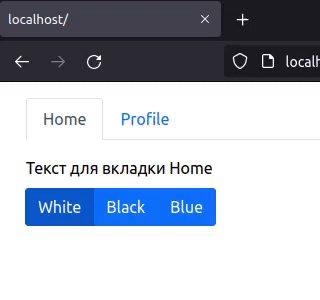

# Хук useContext

В этом задании нужно доработать функциональность изменения темы.

## src/App.jsx

Ознакомьтесь со списком тем. Каждая тема включает в себя класс стилей, который должен присваиваться контенту при переключении темы. Доработайте провайдер темы так, чтобы он хранил выбранную тему в состоянии и передавал всем компонентом данные для работы (список тем, текущую тему, метод для изменения темы).

В компонентах `Home`, `Profile` и `ThemeSwitcher` добавьте получение необходимых данных из контекста.

## Подсказки

Чтобы обернуть один компонент другим, можно воспользоваться пропсом `children`: `<Component>{children}</Component>`.
